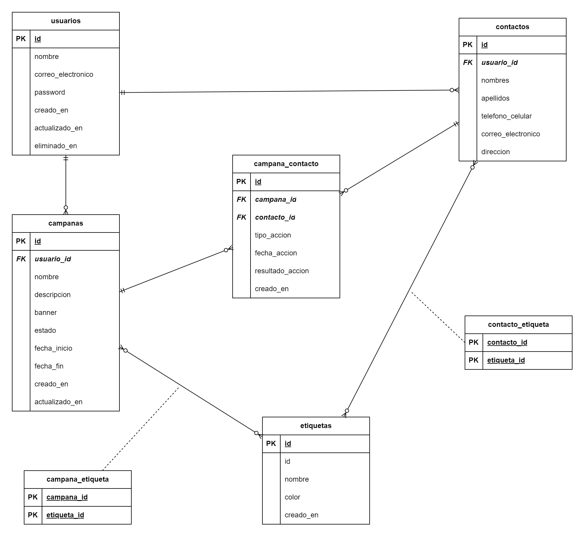

# Curso de desarrollo de API REST con NestJS

## Objetivo del curso

El curso tiene como objetivo principal proporcionar a los participantes las habilidades necesarias para desarrollar una API REST robusta utilizando Nest.js. Al finalizar el curso, los participantes serán capaces de crear, gestionar una API REST que cumpla con los estándares de desarrollo modernos.

## Explicación de la API a desarrollar

### Diagrama Entidad Relación



### ¿Qué funcionalidades tendrá la API?

En este curso, desarrollaremos una API REST para abordar los siguientes requisitos:
Permitir la gestión de campañas de marketing de una empresa. Cualquier usuario (vendedor) puede crear una campaña de marketing y será el responsable de la gestión de sus estados: pendiente, en proceso, finalizada, cancelada, etc. Las campañas pueden tener diferentes etiquetas (tags) que permitan clasificarlas por su interés.

Los vendedores (usuarios) puedan gestionar sus contactos (clientes) a los que se les puede asignar etiquetas (tags) que permitan clasificarlos de acuerdo a sus intereses. Las campañas de marketing son dirigidas a contactos que tengan una o más etiquetas (tags) en común con la campaña de marketing de forma automática cuando la campaña esté en estado en proceso.

Los usuarios realizarán el seguimiento de las campañas de marketing que les han sido asignadas a sus contactos. Para ello, podrán registrar la acción que han realizado con cada contacto (cliente) de la campaña. Estas acciones pueden ser: llamada telefónica, correo electrónico, mensaje de texto, la fecha en la que se realizó la acción y el resultado de la acción: pendiente, exitosa, fallida y sin respuesta. Todo esto mientras la campaña esté en proceso.

Luego de finalizar la campaña, se podrán generar reportes que permitan analizar el resultado de la campaña de marketing. Los reportes pueden ser: cantidad de contactos que se han contactado, cantidad de contactos que han respondido, cantidad de contactos que han comprado, vendedores que han participado en la campaña, vendedores que han tenido más éxito en la campaña, vendedores que han tenido menos éxito en la campaña, etc.

### ¿Qué recursos tendrá la API?

| Recurso                     | Campos                                                                                                                                                       |
| --------------------------- | ------------------------------------------------------------------------------------------------------------------------------------------------------------ |
| Usuario                     | nombre, contraseña, correo electrónico, fecha de creación, fecha de actualización, fecha de eliminación                                                      |
| Contacto                    | nombres, apellidos, teléfono o celular, correo electrónico, dirección, fecha de creación, fecha de actualización, fecha de eliminación                       |
| Etiqueta                    | nombre, color, fecha de creación                                                                                                                             |
| Campaña                     | nombre, descripción, banner, estado (pendiente, en proceso, finalizada, cancelada), fecha de inicio, fecha de fin, fecha de creación, fecha de actualización |
| Acción (Campaña - Contacto) | tipo de accion (llamada telefónica, correo electrónico, mensaje de texto), fecha de acción, resultado de la acción, fecha de creación                        |

### ¿Qué relaciones tendrán los recursos?

#### Usuario

- Un usuario tiene ninguno o muchos contactos
- Un usuario tiene muchas campañas

#### Contacto

- Un contacto pertenece a un usuario
- Un contacto tiene ninguna o muchas etiquetas
- Un contacto puede ser asignado a ninguna o muchas campañas

#### Etiqueta

- Una etiqueta pertenece a ninguno o muchos contactos
- Una etiqueta pertenece a ninguna o muchas campañas

#### Campaña

- Una campaña pertenece a un usuario
- Una campaña tiene ninguna o muchas etiquetas
- Una campaña tiene se asigna a ninguno o muchos contactos

#### Acción (Campaña - Contacto)

- Una acción pertenece a - un contacto
- Una acción pertenece a una campaña

## Configuración del Entorno de Desarrollo

- Node.js y npm
- MySQL (Laragon)
- Postman
- Git (opcional)
- VS Code
  - Configuraciones recomendadas - [settings.json](./.vscode/settings.json)
  - Extensiones recomendadas - [extensions.json](./.vscode/extensions.json)

## Instalación de Dependencias

```bash
$ yarn install
```

o con npm

```bash
$ npm install
```

## Ejecución de la aplicación

```bash
# desarrollo
$ yarn run start

# modo observador
$ yarn run start:dev

# modo producción
$ yarn run start:prod
```

o con npm

```bash
# desarrollo
$ npm run start

# modo observador
$ npm run start:dev

# modo producción
$ npm run start:prod
```

## Autor

[fermelli](https://github.com/fermelli)
